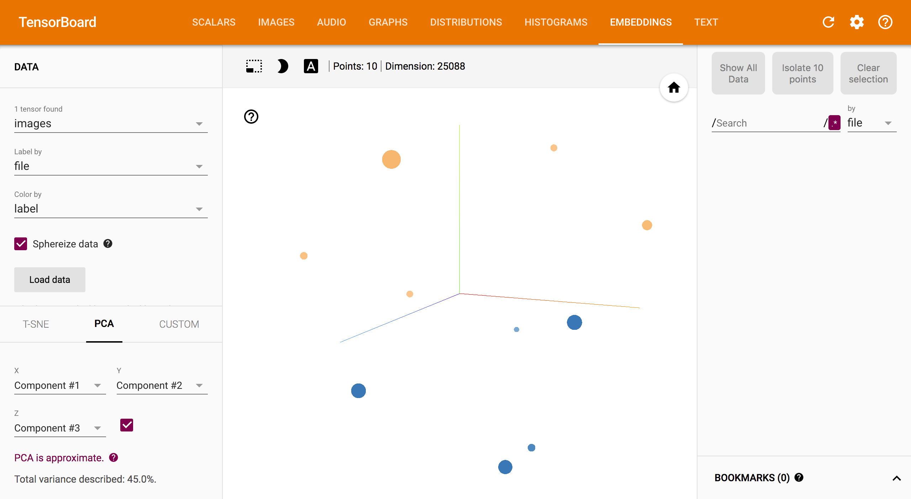

# Embedding Visualization on TensorBoard

Prepare CSV file as below:

```csv
img/01_001.png,0
img/01_003.png,0
img/01_006.png,0
img/01_008.png,1
img/01_012.png,0
img/01_015.png,0
img/01_017.png,1
img/01_024.png,1
img/01_026.png,1
img/01_038.png,1
...
```

First column is the paths of the image files.
Second column is the labels of the images.

## Embed images

```python
import tfmodel

tfmodel.util.embed(input_csv="sample.csv", output_dir="embeddings")
```

## Result



## Resources

* http://killmebaby.tv/special_icon.html
