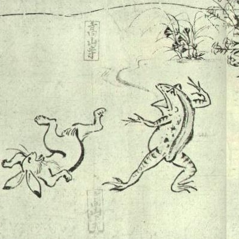
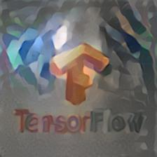

# Neural Algorithm of Artistic Style with TensorFlow

An implementation of "[A Neural Algorithm of Artistic Style](https://arxiv.org/abs/1508.06576)" with TensorFlow.

<p align = 'left'>



</p>

## Requirements

* TensorFlow
* Pillow
* SciPy

## How to Run

Download the repository as below:

```
git clone https://github.com/sfujiwara/tfmodel.git
cd examples/style-transfer
```

Run Python script as below:

```
python style_transfer.py --style img/styles/chojugiga.jpg \
                         --content img/contents/tensorflow.jpg \
                         --tv_weight 0.0 \
                         --content_weight 0.95 \
                         --style_weight=0.05 \
                         --summary_iterations 20 \
                         --iterations 1500 \
                         --learning_rate 1.0
```
